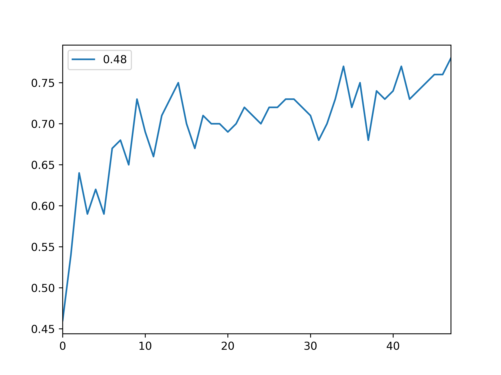

# パターンマッチ
## 概要
画像認識の手法を提案する. 教師データが存在し, 画像にラベルも付随している状況を仮定する. 
得られた画像を認識する際, 教師データとのアダマール積を取る. 同じラベルであるなら一致する確率も大きくなるので, 得られる行列の値も大きくなるのではないかという考えから, 本文を書いた.
## アルゴリズム
1. 行列のノルム`l`を要素に持つベクトルを**L**とする.
2. 判定したい画像`x`と教師画像`t1`のアダマール積を取る.
3. 得られた行列のノルム`l`を取る.
4. **L**の中のラベルに対応する要素に`l`を加算代入する.
5. 1~4を繰り返す. (教師画像: t1, t2, ..., tn)

## 実装
```python
import numpy as np
from time import sleep
from tqdm import tqdm
from keras.datasets import mnist
from keras.utils import to_categorical

def load_mnist():
    (x_train, y_train), (x_test, y_test) = mnist.load_data()

    x_train = x_train.reshape(-1, 28, 28, 1).astype('float32') / 255.
    x_test = x_test.reshape(-1, 28, 28, 1).astype('float32') / 255.
    y_train = to_categorical(y_train.astype('float32'))
    y_test = to_categorical(y_test.astype('float32'))
    return (x_train, y_train), (x_test, y_test)


(x_train, y_train), (x_test, y_test) = load_mnist()
iteration = 1000
cnt = 0
prediction = [0.0 for i in range(10)]

acc = []
while(iteration < 100000):
    for i, image in enumerate(tqdm(x_train[0:100])):
        for j in range(iteration):
            rnd = np.random.randint(len(x_test))
            image = np.reshape(image, (28, 28))
            t_image = np.reshape(x_test[rnd], (28, 28))
            image = np.array(image)
            t_image =np.array(t_image)
            prediction[np.argmax(y_test[rnd])] += np.linalg.norm(image * t_image)
        if np.argmax(y_train[i]) == np.argmax(prediction):
            cnt += 1

        prediction = [0.0 for i in range(10)]

    print('iteration:', iteration, '\t', 'acc:', cnt / len(x_train[0:100]))
    iteration += 1000
    cnt = 0
    acc.append(cnt / len(x_train[0:100]))

print(acc)
```

## 結果
  

acc0.75程度という結果で理論が通ったのはわかった.  
やっぱり黙ってcnnしよう.
